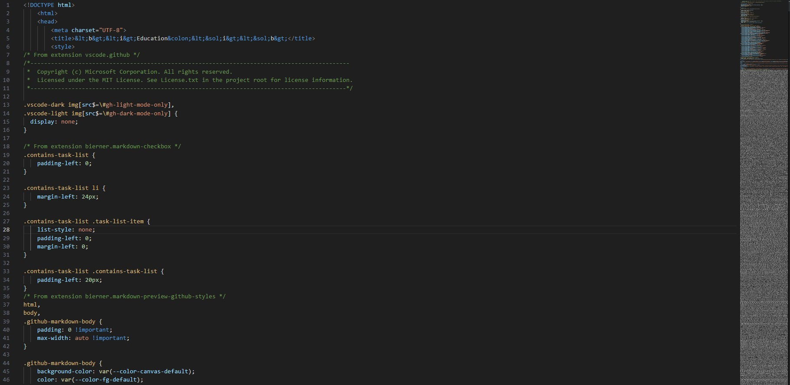

# source-code
<i>Web-development <b>data-extraction</b> tool</i> for  CI/CD enhanced processes

HTML Websites data fetch is equivalent to [view-source](https://chrome.google.com/webstore/detail/<view-source>/dmfgkkcgfcaciolbfagclhaainpigkmd) <i>(browser-independent)</i> & opened in VS Code for its inspection intended for web-development & data encryptions in <b>compliance</b> with users privacy rights (GDPR) & local <u>laws</u>.

<b>Usage: </b>
``` bash
$ ./html-extractor.sh
Enter a URL: https://estebanmqz.github.io/EstebanMqz/html/Resume.html
Do you want to extract the raw code to a temporary file? (Y/N): Y
Enter a filename to save the raw code: Resume
Raw code extracted to Resume.html
opening..
```



<!--  -->
.<br>.